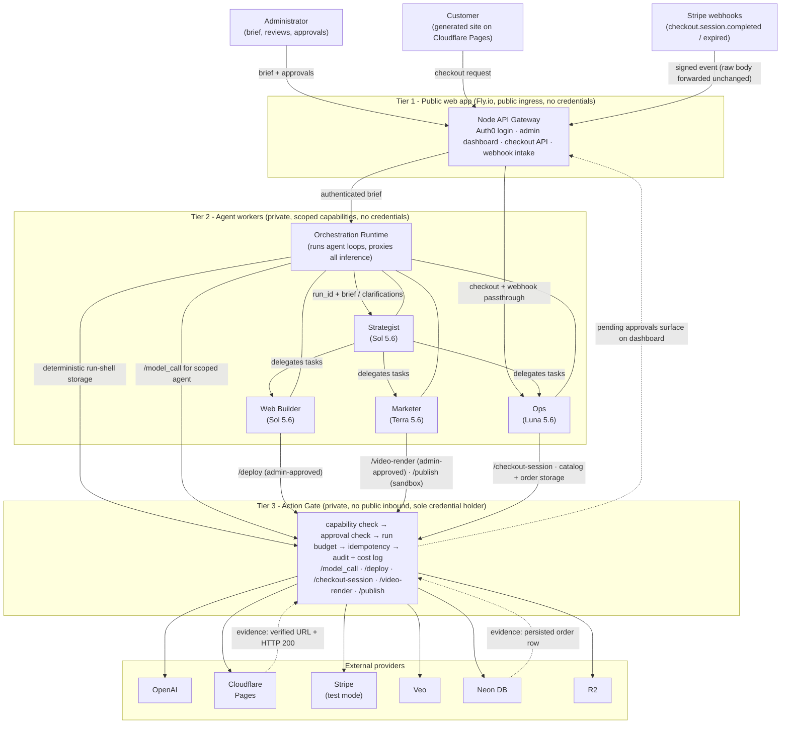

The epyhia system is generating a specific type of business infrastructure and marketing from a prompt. 

On the backend, from a prompt, the epyhia system will

Generate marketing website.

The generated marketing websites are uploaded to Cloudflare. In a longer term infrastructure, this might be provisioned in Github on a per-repo basis but not in scope for this project. 

Currently 1 tenant is tied to 1 business. 

Sample Business
Party Rentals - Local Party Rentals business for residential and small business events. The business rents tables, chairs, tents, generators, audio system for residential and small business use. Rentals are for specific quantities of items and for a fixed term. 

Business charges:
pay-in-full at booking: qty × day_rate × rental days per item

Out of scope: late fees, customer alerts or reminders, backend delivery scheduling or worker tracking, security deposits. 

Flow 1 - Business Creation Flow (interactive - 2-5 minutes of time including human interactions)
Administrator (me) logs in and in the Admin dashboard of epyhia, enters a business description prompt. 

Tier 1 forwards the authenticated submission and administrator identity to deterministic control-plane code in the Orchestration Runtime. The Runtime requests a plain Action Gate storage action—without an LLM call—to create the onboarding request and run shell in one transaction. The shell has status CREATED, the original brief and hash, the administrator-approved budget and approver identity, and a NULL brand_document_id. Retrying the same (tenant_id, idempotency_key) returns this existing run_id. Tier 1 never calls Tier 3 directly.

The Orchestrator/Strategist checks the completeness of the brief against that run_id
- data exists for initial population of business catalog (Ops agent request the Action Gate to do persist catalog data in DB)

If the prompt is considered incomplete, getting more information is done by interactively asking the user through Tier 1

Orchestrator produces the completed brief, brand identity document, and task plan. Every inference is routed by the Runtime through the Action Gate and logged against the run shell.
Ops will do the semantic finalization and persistence of these outputs.
The orchestrator delegates to Ops for finalization. Ops invokes the Action Gate to persist a new brand-document version, set the run's brand_document_id, create the task records, and transition the same run to EXECUTING. Run-shell creation is deterministic control-plane work and is never routed through an Ops model call.

One that is done - then a dashboard view is created so that the user can see the status (brand document - pending, Web Builder: Pending, Maketing: Pending)

Polling will happen in the background against this task table and then the dashboard is updated. 

The web builder , using the brand doc, will be kicked off to start the task for HTML/CSS generation based on design criteria, That HTML/CSS is persisted, and then pushed to Cloudflare and a URL is returned and stored. The task table is updated. 

The marketer using the brand doc, will generate the marketing copy for the website along with marketing posts. Marketing posts will be stored in marketing_artifacts (segregated with tenant Id) and generate a story board. That is a human review, and if the story board is approved, then a video is generated (via Veo) . Marketing actions will need human review so the dashboard will reflect the need for human review. If editing is needed, the human can prompt for the change (max 5 Veo generations per tenant for both types of Veo renders) otherwise the task dashboard is updated and the marketing collateral is stored. Story board generation is cheaper then Veo, so splitting it to require one approval for story board and the other for Veo generation.
The Vertical Cut video will be a 2nd Veo invocation. 
Veo Video Generation via kdowswell/veo-tools

Ops agent will be doing the initial population of the schema (including the tenant id) via the Action gate - this is also a task in the task list
Note: The brief should consist of the items in the prompt. If the prompt does not include them, the orchestrator gets them, the orchestrator at the end gives a fully populated prompt. 

Flow 2 
Business operations flow for party rental

- Customer selects one or more items at public facing website for checkout 
- Initiates a backend call 
 - based on email loads or inserts customer row
- which checks availability and inserts reservation with PENDING status. 
- Note that PENDING reservations count against availibility. 
- create Stripe checkout session (test mode) - idempotency key is derived from reservation ID and sent to Stripe. Stripe Session URL returned. 
- Stripe redirects back - web hook (checkout.session.completed) is invoked which flips reservation to Confirmed. Stripe signature is verified when updating the reservation. 

Business Customer Order Persistence
Table: Orders 
id, created_at, tenant_id, reservation_id, stripe_checkout_session_id, amount, currency, status, payment_timestamp
Both reservation_id and stripe_checkout_session_id are separately unique

Table: webhook_events 
id, created_at, stripe_event_id (primary key)

Characteristics:
Stripe signature verification in Tier 3 before processing.
Transactional: records the event, inserts the order, and confirms the reservation. Otherwise rollback
Duplicate events return success without creating anything new.
Customer transaction status is done via DB querying (not simply success redirect)
Add check for stripe amount and currency match to reservation table 
Before inserting an order, payment_status must be PAID. Insert exactly one order, change reservation status to CONFIRMED (from PENDING). Commit txn, else rollback
Insert the order with status = PAID and payment_timestamp from Stripe.
Note: to avoid floating point math, prefer use cents. 
Flow 3 - expired reservations cleanup
Business Operations Flow for Expired Rentals (Abandoned checkout)
If a customer reserves but never pays, we have abandoned checkouts. Use Stripe Checkout expiration web book to cancel those after 1 hr. 

Important Notes: Stripe always uses test-mode keys.
Email goes only to a configured mail catcher.

Social publishing produces drafts or sandbox records—never posts to real accounts.
Cloudflare deployment is a public, live action and needs admin approval (bound to deployment hash) prior to Tier 3 execution.
Paid video rendering remains disabled until the administrator approves the exact storyboard/payload and cost.
All actions default to TEST; the gate rejects unsupported LIVE actions.

For Stripe checkout:
The browser sends only item IDs, quantities, rental dates, and customer details.
It never sends an authoritative price, total, currency, or tenant ID.
Tier 3 loads catalog prices from Neon, validates date overlap and availability, calculates rental days and the total in cents, and creates Stripe line items.
Tenant identity comes from the site/host mapping or authenticated context.
The webhook compares Stripe amount and currency with the persisted reservation before creating the order.

Implementation Architecture

Technical Stack
Marketing website: Cloudflare Pages 
Epyhia backend: 
Node API Gateway
Node backend workers
Storage: Neon DB and Cloudflare R2 
Authentication: Auth0 

1. Tier 1 — Public web app, reachable from the internet.
2. Tier 2 — Private Strategist, Web Builder, Marketer, and Ops workers. Tier 2 is reachable only from Tier 1, receives scoped capability handles, has no public ingress, and holds no credentials.
3. Tier 3 — Private Action Gate. Tier 3 is reachable only from Tier 2, has no public ingress, and exclusively holds the OpenAI, Cloudflare, Stripe, Veo, Neon, and R2 credentials.

All three tiers deploy to Fly.io as separate apps or services. The Action Gate is private-network-only and reachable solely from Tier 2.

Stripe webhooks enter through Tier 1. Tier 1 and Tier 2 forward the raw request body and Stripe signature unchanged to Tier 3 for verification.

Agents can call - based on their capabilities 
- /model_call
- /deploy
- /checkout-session
- /video-render
- /publish

Action Gate will check for capability authorization and applicable approval separately. And idempotency via audit record. 
To be clear: Capability - the agent is allowed to request
Admin Approval: Admin human has approved a deployment, social media publish, or video generation
Customer Approval: via public interface Stripe
LLM calls are part of model capability and constrained by per-run budget already approved by human.
This means that agents cannot reach those providers, even if misprompted. 
Deployment, marketing publishing, video rendering, LLM calls will be within the credentialed process group (audit and cost logging - not exposed to public web directly) 
Note that stripe checkout contains customer approval but cloudflare deployment, Video generation and social media or emails require admin approval. 
API Gateway (web process group)

Action Code (gated) needs
- run_id, tenant_id, agent_name, action, destination_url, destination_params, cost, approved_by, timestamp, idempotency_key, status (pending_approval, approved, executed, failed) and mode (test or live), payload_hash, approved_at
Approval applies to a specific payload only. 
/deploy will deploy to Cloudflare 
/checkout_session works against Stripe test mode
/publish - for video renders or social media and email

Orchestrator, Marketer, Web Builder, Ops agents are in the Tier 2 group.
They are independently scalable. 
These will never take independent actions belong to the Action gate (charge money, live publish, social media) 

Orchestrator: 
Accepts the initial prompt
Generates to brand doc
Creates work for the Marketer, Web Builder, and Ops 
Does not invoke the Action Gate directly - delegates only to specialist agents. Does not initiate deployment, video generation, or customer payment actions It does not hold any credentials including DB. 

Top intelligence tier: OpenAI Sol 5.6
- the brand doc guidance will contain the key intelligent and GTM approach - need max intelligence  

MArketer: 
Receives the brand document from Orchestrator
Does not initiate deployment, or customer payment actions
Mid Intelligence tier: OpenAI Terra 5.6
- This will generate landing copy + 3-5 social posts + a launch email + a launch video with a vertical social cut via Veo. 

Web Builder:
Generates HTML / CSS for marketing website
Sends to Action Gate for Cloudflare deployment
Initiates deployment via the Action Gate
High Intelligence tier: OpenAI Sol 5.6
- Need good code generation and ability to consume the brand doc and incorporate its guidance and avoid ai slop. Since Design is highly important to earn customers, this is <$1 spend for something customers will see. 

Avoiding AI slop in Design

- LLM call (independent) which takes the brand document and the rendered HTML and checks it.
 - response is either approved, or specific feedback
- Cap at 3 revision rounds
- judges rendering on mobile and web, not the source code
- uses Terra 5.6 

- Good Taste: Based on my web research, the low hanging fruit to avoid AI slop is to have a detailed prompt that outlines a design that you want - dont say “create a local rental business site”, you need to say “Create a high converting landing page for a local rental business targeted towards X” There should be a headline, one sentence under the headline, and easy way to build customer trust, answer the customers questions and allow them to contact us. The FAQ should be an accordion. Most customers will be on mobile, the visual theme should be light. The design should be for a local business, not a corporate one” Combined with the brand document.  Reference: https://superdesign.dev/blog/ui-design-prompts 
The idea will be to parameterize this prompt template.

Ops 
Asks the Action Gate to persist the initial catalog in DB
Does not initiate deployment, video generation, , or customer payment actions
Does not charge directly, requests a checkout_session after customer initiates checkout.
Ops lower intelligence tier: OpenAI Luna 5.6
- this is doing directed business actions and does not need to independently reason
- check for Avoiding AI slop for marketing accuracy

Avoiding AI Slop in accuracy

Non-LLM checks
- cross check pricing on HTML vs database catalog
- regex for lorem ipsum, TODO
- check contact details match customer details 
- validate hyperlinks , valid HTML, images are valid, viewport meta is present, URLs return 200 status

Summary of Capabilities with respect to external systems
Strategist: clarification and delegation only.
Web Builder: site storage and approved deploy requests.
Marketer: artifact storage, approved video-render requests, and sandbox publishing.
Ops: catalog/reservation storage, Checkout Session requests, and persisted-order verification.
Tier 3 rejects any requested capability not explicitly allowed for that agent. Capability authorization never replaces the required administrator or customer approval.

Pricing for short context as of August 8, 2026
gpt-5.6-sol $5.00 per 1M input tokens / $30.00 for 1M output tokens
gpt-5.6-terra $2.00 per 1M input tokens / $12.00 for 1M output tokens
gpt-5.6-luna $0.20 per 1M input tokens / $1.20 for 1M output tokens

Database Schema 

Table: tasks (for admin dashboard)
id, tenant_id, run_id, task_type, status, output_ref, updated_at, with a unique key on (run_id, task_type).

Table: Tenants (note: this is a customer of Epyhia)
Id, name, email, business_name, business_slug, business_email, business_phone, business_address

marketing_artifacts:
id, tenant_id, run_id (foreign key → runs.id),
brand_document_id, artifact_type, sequence_number, channel,
text_content, r2_object_key, mime_type,
self_review_status, grounding_check_status, review_feedback,
approval_status, approved_by, approved_at,
created_at, updated_at

artifact_type is one of 
LANDING_COPY, SOCIAL_POST, LAUNCH_EMAIL
VIDEO_STORYBOARD, VIDEO_LANDSCAPE,  VIDEO_VERTICAL

unique (run_id, artifact_type, sequence_number)
Notes: Video storage in R2. The DB  stores metadata and object references.
The Marketer’s self-review and factual-grounding check must pass before an artifact becomes approval-eligible.
Storyboard approval occurs before the paid video-render action.
Every artifact needs to reference the brand-document version that produced it.
Reruns create artifacts under a new run_id
they do not overwrite the earlier pack.
If an artifact is text, text_content is not empty. whereas for videos, r2_object_key and mime_type must be present. 
Marketing tasks are COMPLETE when the run contains sufficient content (1 landing copy, 1 email, 1 storyboard , 1 landscape and 1 vertifcal video, and 3-5 posts) referencing the same brand_document_id

Table: reservations (id, tenant_id, customer_id, start_date, end_date, status, total, stripe_checkout_session_id, created_at)
Table: reservation_items (id, reservation_id, rental_item_id, qty, day_rate)
Table: rental_items(id, tenant_id, name, description, available_qty, day_Rate)

customers:
id, tenant_id, name, email, normalized_email
normalized_email = lower(trim(email))
unique (tenant_id, normalized_email)

deployments:
id, tenant_id, cloudflare_project_name,
live_url, last_action_id, verified_at, updated_at
unique (tenant_id)
unique (cloudflare_project_name)

onboarding_requests:
id, tenant_id, idempotency_key, run_id (foreign key of runs.id), created_at
unique (tenant_id, idempotency_key)

Note that the actions log is the audit table

Table: runs
id (primary key), tenant_id, original_brief, completed_brief, brief_hash,
brand_document_id, approved_budget_microdollars, budget_approved_by, status, created_at, completed_at

Table: agent_calls
id (primary key), run_id (foreign key → runs.id),
task_id (foreign key → tasks.id), agent_name, model_id, model_tier,
input_tokens, cached_input_tokens, output_tokens, cost_microdollars,
status, started_at, completed_at

Table: actions
id (primary key), tenant_id, run_id (foreign key → runs.id),
agent_name, action_type, payload_hash, idempotency_key, mode,
approval_status, approved_by, approved_at, provider_reference,
provider_cost_microdollars, status, created_at, executed_at

Unique constraint:
(tenant_id, action_type, idempotency_key)

Requirements for these:
Store monetary cost as integer microdollars, not floating point.
Never store credentials or unredacted payment data in audit payloads.
run_id must connect brief to tasks to agent calls to actions.
runs.total_cost_microdollars is derived from agent calls and paid provider actions
It is a query derived from agent_calls.cost_microdollars + actions.provider_cost_microdollars

Brand Document

Contains:
Business Story: Background, Mission, Strengths, Target Demographic
Logo and logo usage guidance
Typography Rules
Writing Tone and Grammar Guidance 
Color PAlletes
Imagery Guidance: Dos and Donts
Layout Template guidance for Social Media 
Contact Details

What's in it:

where does it live: 
Brand_document_table which is a versioning table of brand documents per tenant. The full_text is stored in the DB table
Schema: id, tenant_id, version_number, full_text
Unique on (tenant_id, version_number)
If the brand document changes (via the Admin Dashboard), a new entry is created and then the sequence of marketing website and social media posts is re-run. 

IDempotency

Idempotency for business creation (tenant onboarding) is described in onboarding with the task list.
Duplicate brief submission
brief_hash may warn the administrator that identical content was previously submitted, but it does not enforce idempotency. The same idempotency key returns the existing run; a new key intentionally creates a new run for the same tenant business and deployment.

Deployment Idempotency: one Cloudflare project per tenant; re-deploy overwrites, never creates a second site. 

Stripe idempotency: derived from the reservation id; webhook handler dedupes by Stripe event id (Stripe retries webhooks)

Database rules
Retrying with the same onboarding idempotency key returns the existing run and dashboard.
An intentional regeneration uses a new idempotency key, creates a new run and brand version, but updates the same business and Cloudflare project.
Retrying a failed task updates/reuses the existing (run_id, task_type) row rather than inserting another logical task.

Failure Catalog

1. Tenant customer paid for business creation but didn’t get a deployed website: On a failed deploy, a check should occur that deployed URLs are returning 200. Failure to deploy should attempt 1 retry, otherwise send an alert to the epyhia Administrator. The Administrator will receive a message saying the failure has been logged and being investigated. 
2. Tenant customer receives marketing copy which does not match their wishes. Off-brand, False or inaccurate Claims on marketing: incorporate human reviews for marketing copy
3. Business customer gets double charged. Duplicate charges on crash or retry - see Stripe idempotency
4. Epyhia Business cannot control costs. Irreversible actions - publish, go-live, and video generation go through human review via the gate. Customer initiated charges are already human approved (initiated by human customer)
5. Tenant Customer gets false information put on their marketing copy.  Fabricated social proof - incorporate into the marketing prompt to be honest and not include reviews/testimonials 
6. Business Customer receives inaccurate reservation confirmation information. Business logic - double booking avoidable. Business logic checks for quantity available before booking using SELECT for UPDATE Also needs to check date overlaps. .
7. Inaccurate descriptions on website vs DB Schema. After website is generated, conduct a programmatic check of the website vs business catalog descriptions and prices

